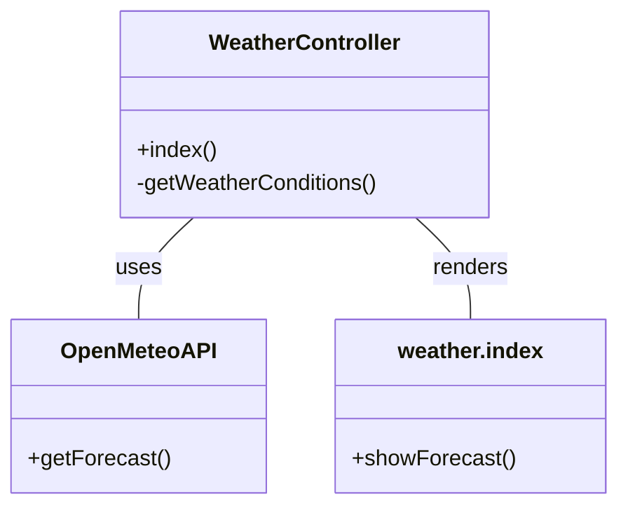

# copilot-hans-on

# 天気予報アプリ仕様

## 概要
大阪の1週間分の天気予報をOpen-Meteo APIから取得し、天気コードを日本語の天気状況に変換して表示します。

## 主な機能
- Open-Meteo APIから大阪の天気予報（7日分）を取得
- 天気コードを日本語の天気名に変換
- 最高気温・最低気温・降水量・最大風速も表示
- エラー時はエラーメッセージを表示

## 天気コード一覧
| コード | 意味                     |
|-------|--------------------------|
| 0     | 快晴                     |
| 1     | 晴れ                     |
| 2     | 一部曇り                 |
| 3     | 曇り                     |
| 45    | 霧                       |
| 48    | 霧雨                     |
| 51    | 弱い霧雨                 |
| 53    | 霧雨                     |
| 55    | 強い霧雨                 |
| 56    | 弱い凍雨                 |
| 57    | 強い凍雨                 |
| 61    | 弱い雨                   |
| 63    | 雨                       |
| 65    | 強い雨                   |
| 66    | 弱い凍雨                 |
| 67    | 強い凍雨                 |
| 71    | 弱い雪                   |
| 73    | 雪                       |
| 75    | 大雪                     |
| 77    | 雪粒                     |
| 80    | 弱いにわか雨             |
| 81    | にわか雨                 |
| 82    | 激しいにわか雨           |
| 85    | 弱いにわか雪             |
| 86    | 激しいにわか雪           |
| 95    | 雷雨                     |
| 96    | 弱いひょうを伴う雷雨     |
| 99    | 強いひょうを伴う雷雨     |

## システム構成（UML）

## 参考
- Open-Meteo API: https://open-meteo.com/en/docs#api_form